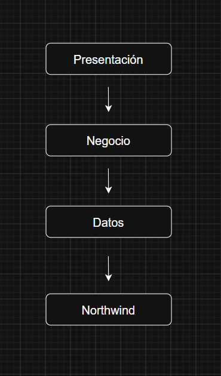

***1. Capa Presentación***

Interacción usuario.

Funciones:

- Mostrar datos.
- Capturar eventos.

***2. Capa Negocio***

Procesamiento.

Funciones:

- Validaciones.
- Aplicación reglas.

***3. Capa Acceso Datos***

Comunicación con Northwind.

Funciones:

- CRUD
- Consultas

***4. Capa Entidades***

Representación de tablas.

Customer.cs

Order.cs

Product.cs

### ¿Por qué LINQ debe ir en la capa de Negocio?

| Punto | Explicación |
|---------|------------|
| **Reutilización** | Las consultas LINQ se escriben una sola vez en la capa de negocio y pueden ser utilizadas por diferentes formularios o módulos de la aplicación. |
| **Separación** | Mantiene separada la lógica de negocio de la interfaz de usuario y del acceso a datos, facilitando el mantenimiento del código. |
| **Escalabilidad** | Permite agregar nuevas reglas o consultas sin modificar la presentación, haciendo que el sistema crezca de forma ordenada. |
| **Patrón Repository** | LINQ se utiliza dentro de los repositorios para consultar y filtrar datos, mientras que las demás capas consumen esos resultados sin conocer los detalles de acceso a datos. |
| **Integración de LINQ** | LINQ se integra en la capa de negocio para procesar, filtrar, ordenar y transformar datos obtenidos desde la capa de datos antes de enviarlos a la interfaz de usuario. |

### Patrón Repository

Permite organizar el acceso a los datos en repositorios. LINQ se integra para realizar consultas de forma sencilla y mantener el código más limpio y mantenible.

***Flujo de ejecución***

[← Marco Teórico](teoria.md)

[🏠 Inicio](index.md)

[Siguiente → Northwind](northwind.md)
