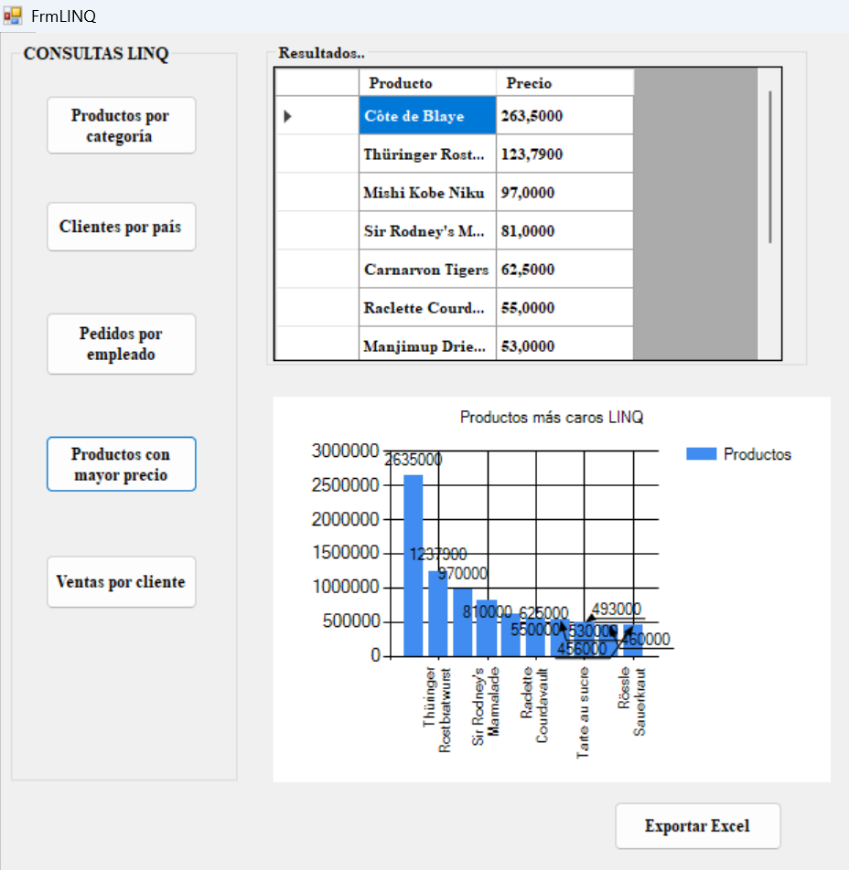

***Conclusiones***

LINQ constituye una herramienta eficiente para gestionar consultas dentro de arquitecturas multicapa.

Su integración con Northwind permite implementar sistemas mantenibles y alineados con prácticas modernas de ingeniería de software.

[← Consultas](consultas.md)

[🏠 Inicio](index.md)
