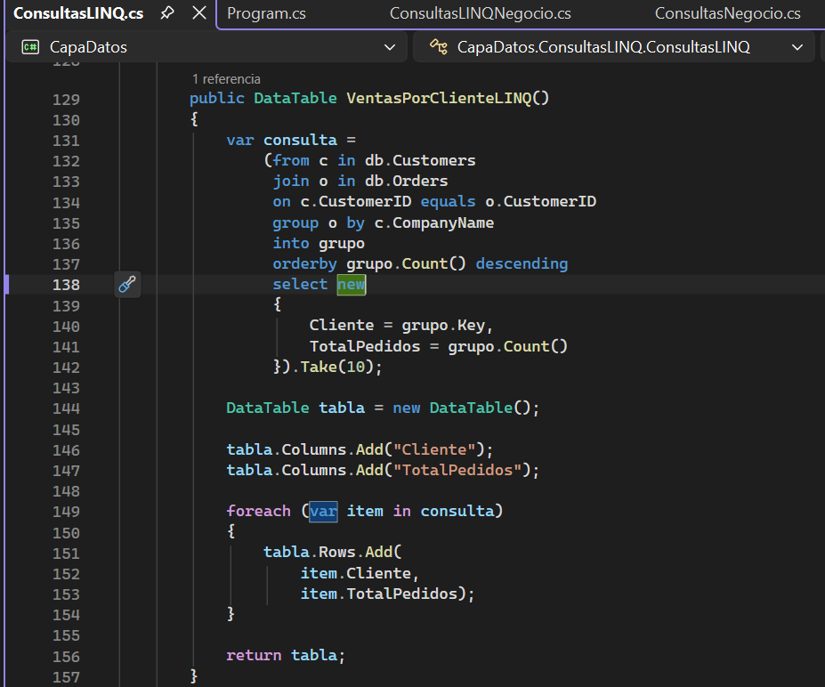
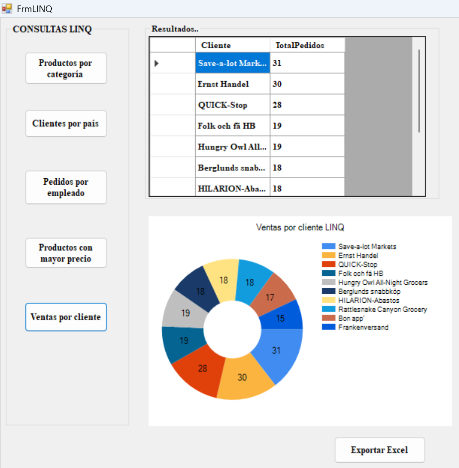
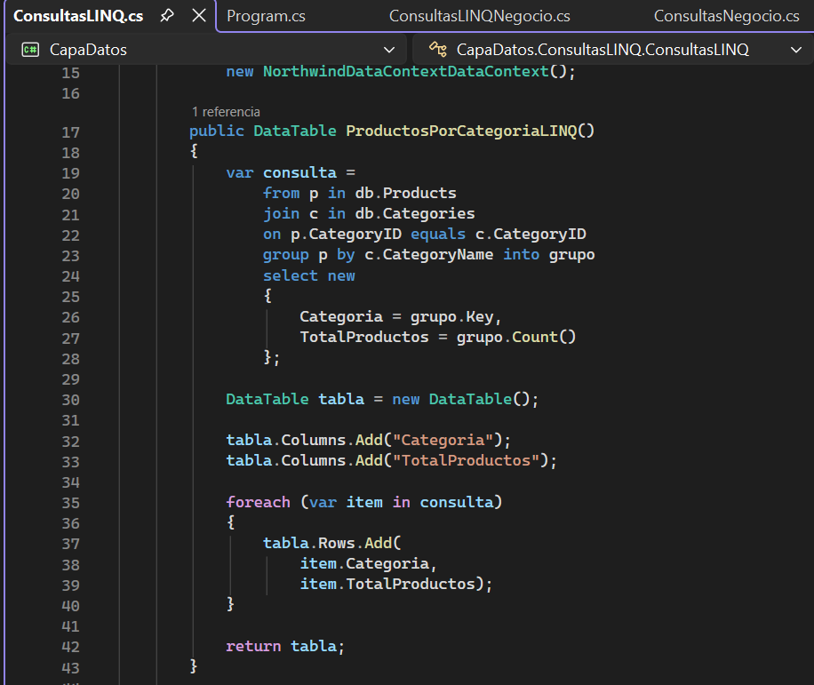
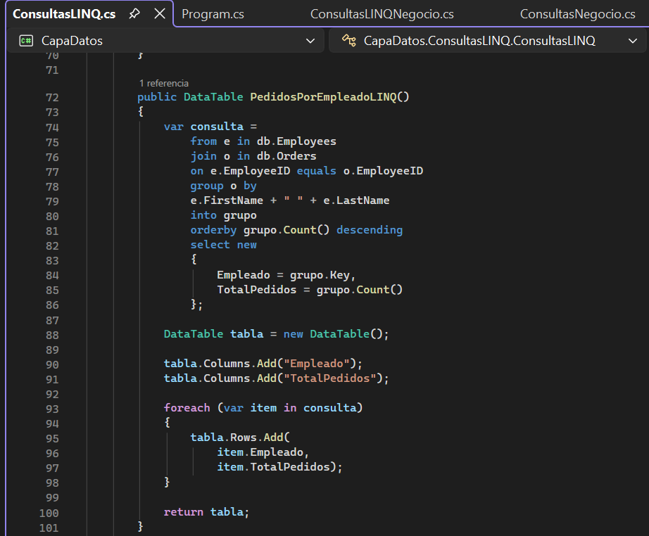

***Consulta 1 — Clientes por país***

public List ObtenerClientes(string pais)

{

return contexto.Customers

.Where(x=>x.Country==pais)

.ToList();

}

***Consulta 2 — Productos ordenados***

public List Productos()

{

return contexto.Products

.OrderBy(p=>p.ProductName)

.ToList();

}

***Consulta 3 — Ventas agrupadas***

var ventas=

contexto.Orders

.GroupBy(o=>o.CustomerID);

***Consulta 4 — JOIN***

var consulta=

from o in Orders

join c in Customers

on o.CustomerID equals c.CustomerID

select new

{

c.CompanyName,

o.OrderDate

};

***Consulta con JOIN***

***Consulta con GROUPBY***

[← Northwind](northwind.md)

[🏠 Inicio](index.md)

[Siguiente → Consultas](consultas.md)
