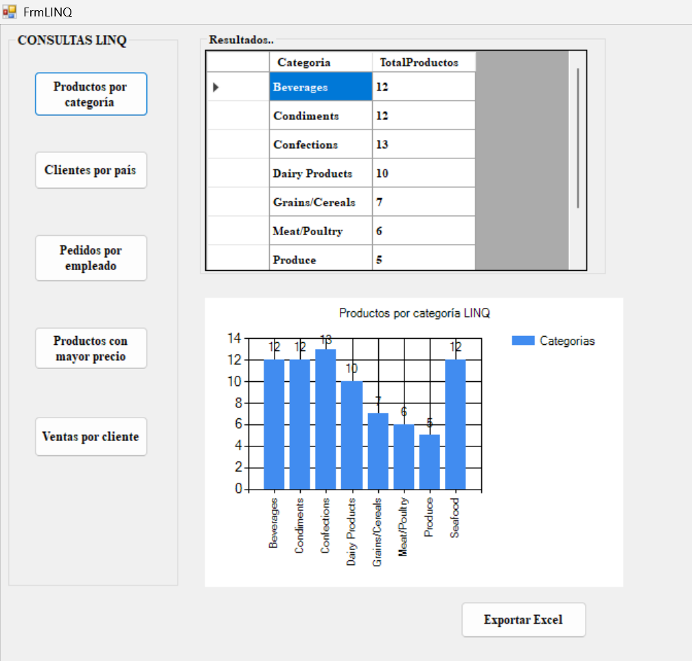

***Resumen***

El presente manual documenta la implementación de Language Integrated Query (LINQ) dentro de una arquitectura multicapa desarrollada en C#, utilizando como fuente de datos la base Northwind.

El documento describe la integración de consultas LINQ en la capa de acceso a datos y capa de negocio, demostrando cómo esta tecnología mejora la legibilidad del código, reduce operaciones repetitivas y facilita el mantenimiento del software.

Se presentan ejemplos prácticos orientados a operaciones reales sobre clientes, productos, pedidos y categorías, siguiendo principios de separación de responsabilidades y diseño escalable.

Palabras clave:
LINQ, C#, Arquitectura Multicapa, Entity Framework, Acceso a Datos, Northwind.

***Introducción***

Actualmente las aplicaciones empresariales requieren mecanismos eficientes para consultar y transformar información.

LINQ surge como una extensión del lenguaje C# que permite integrar consultas directamente dentro del código fuente.

Su uso dentro de arquitecturas multicapa mejora:

• Separación de responsabilidades
• Escalabilidad
• Legibilidad
• Mantenimiento del sistema

Para este manual se emplea la base Northwind como entorno de simulación empresarial.

***Objetivo General***

Diseñar e implementar consultas LINQ dentro de una arquitectura multicapa utilizando C# y Northwind.

***Objetivos Específicos***

- Comprender el modelo de LINQ.
- Integrar consultas dentro de la capa de negocio.
- Optimizar acceso a datos.
- Documentar el proceso mediante GitHub Pages.

[🏠 Inicio](índice.md)

[Siguiente → Marco Teórico](teoría.md)
